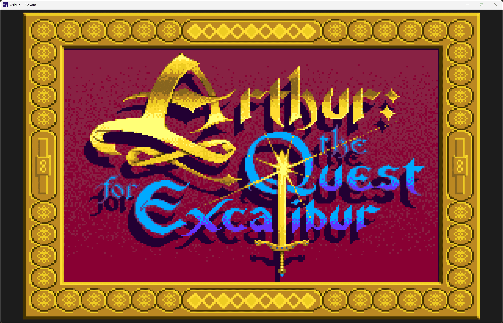
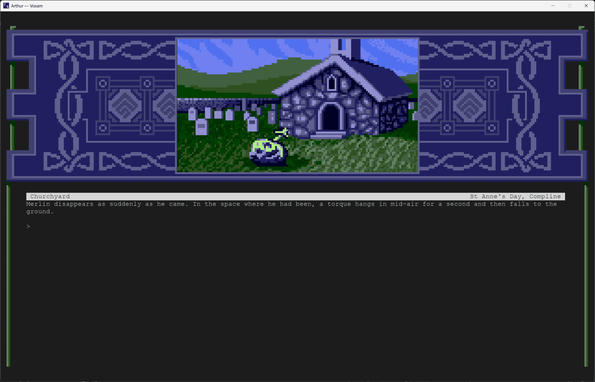
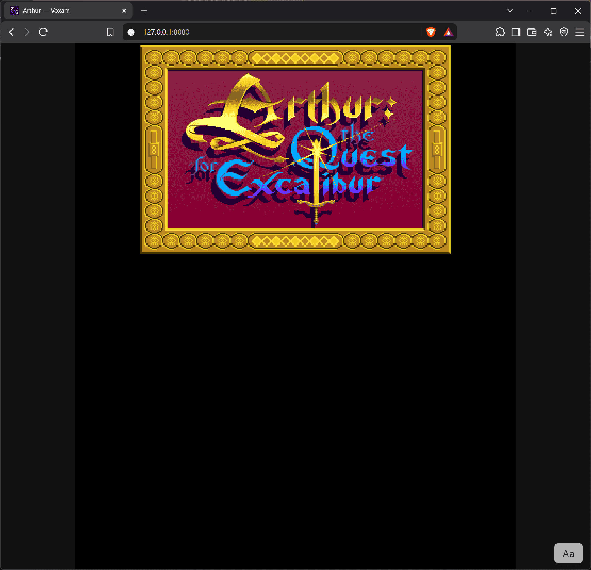
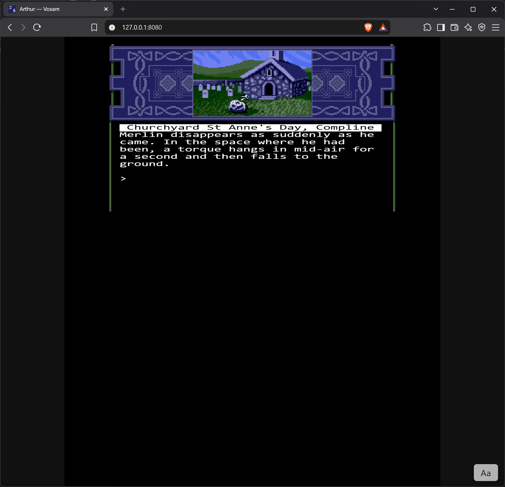
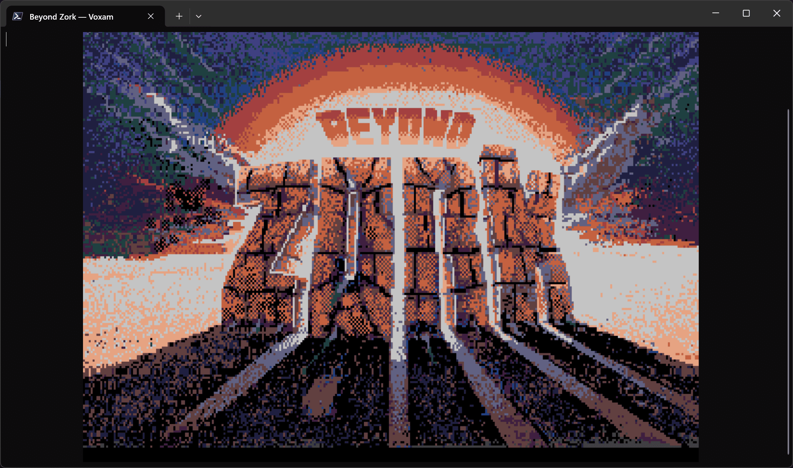
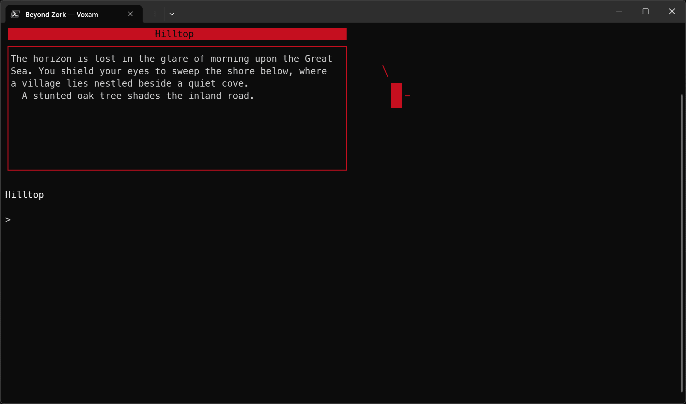
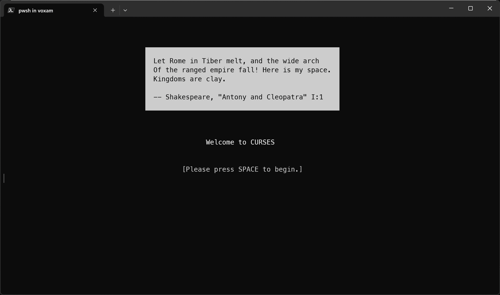
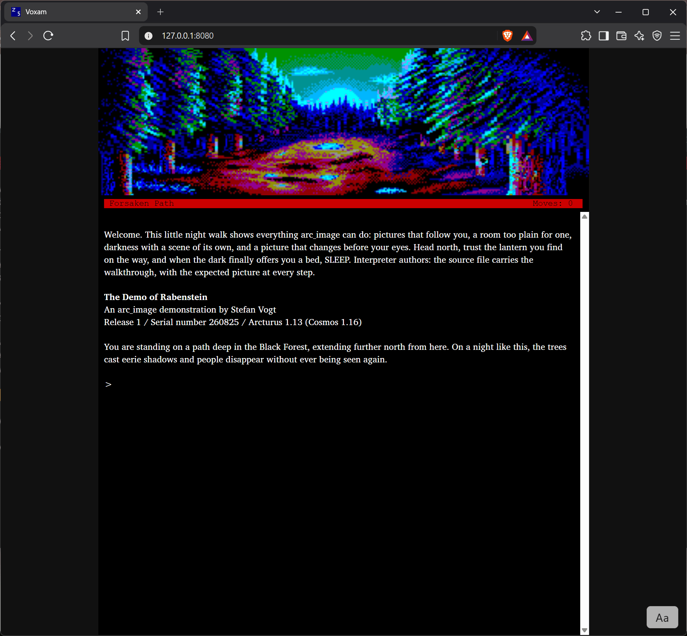

# Voxam, in pictures

Voxam plays at several faces, and they are not the same thing seen
twice: a painted terminal, a pixel window, and a browser tab each
draw what the machine says in the way their medium allows. These
are real sessions, not mockups.

The short version of how to reach each one is in
[PLAYING.md](PLAYING.md); the claims they illustrate are kept in
[STATUS.md](STATUS.md).

## One story, two faces

*Arthur: The Quest for Excalibur* is a Version 6 game, which means
its screen is not a grid of characters but a drawing surface: the
§8.8 stage, with windows placed in the art's own coordinate space.
Voxam keeps one model of that stage and lets each face render it.

### The pixel window

`voxam --graphics arthur-r74-s890714.z6`

The title art inside its illuminated border, drawn from the story's
own picture data. The window names itself from the Treaty of Babel
record, and the title bar carries the version's own badge.

A few turns in: the Churchyard, the Celtic frame around the scene,
and the status line reading the game's own reckoning of the hour,
*St Anne's Day, Compline*.

### The browser tab

`voxam --web arthur-r74-s890714.z6`

The same stage, the same story, served over HTTP and drawn by the
browser. The tab wears the story's name and the Version 6 mark.

And the same Churchyard. A Version 6 screen is a hard case for a
web display, because nothing about it is a character grid.

## The painted terminal

A terminal is the oldest face and still the most common one. Voxam
does not treat it as a lesser target.

`voxam --pixels --interpreter amiga beyondzork-r57-s871221.z5`

*Beyond Zork*'s splash art, in a terminal, in real pixels. Where the
terminal speaks sixel, `--pixels` draws a story's pictures rather
than describing them.

The game proper: the location bar in the story's own colors, the
description boxed as *Beyond Zork* arranges it, and the compass
rose it keeps beside the text.

Both were run claiming the Amiga's identity. *Beyond Zork* asks
which machine it is running on and reshapes its whole screen model
around the answer (§11.1.3, §16), so the flag is less a
compatibility switch than a personality dial: an IBM session is a
different-feeling game. [PLAYING.md](PLAYING.md) keeps the roster
and what each identity is worth.

*Curses* opens on an epigraph from *Antony and Cleopatra*, set in a
quote box. The box is the story's, drawn with the §8 window model
and the reverse-video the game asks for.

## Pictures beside the text

`voxam --web rabenstein-r1-s260825.z5`

*The Demo of Rabenstein*, written in
[Arcturus](https://github.com/8bitgames/arcturus) and compiled to
Z-code, hanging its art above the text with `arc_image`: a picture
that follows the player from room to room, over a status line in
the story's own red, with the prose set in the face Voxam brings
with it.
